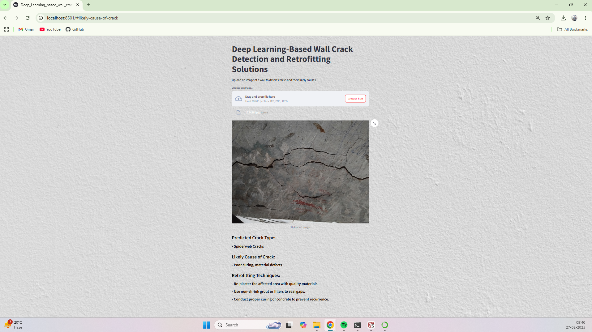

# Deep-Learning-based-wall-crack-detection-and-retroffiting-solution

## Project Title
Wall Crack Detection and Retrofitting Solutions.

## Project Overview
This project focuses on detecting cracks in walls using deep learning models and suggesting suitable retrofitting techniques. 
By analyzing images, the system can classify walls as cracked or non-cracked. If a crack is detected, it further categorizes 
the crack type (horizontal, vertical, diagonal, web-shaped) and provides insights into possible causes along with retrofitting solutions.

This solution can be useful for construction companies, civil engineers, and property owners to assess structural damage 
and take necessary preventive measures.

## Features of the Project

1. Detects cracks in wall images.
2. Classifies crack types (horizontal, vertical, diagonal, web-shaped).
3. Provides possible causes of cracks.
4. Suggests suitable retrofitting solutions.
5. Uses MobileNet as the primary model for detection and classification.
6. User-friendly interface for uploading and analyzing images.
   
## Technologies Used
- Python
- OpenCV
- TensorFlow/Keras (MobileNet, ResNet50, CNN, VGG16)
- Pandas, NumPy
- Streamlit (for the web app)
  
## Dataset
The dataset consists of wall images labeled as "Cracked" and "Non-Cracked."  
Since specific crack type labels were not available, manual annotation was performed to classify cracks based on their orientation and pattern.  
The dataset includes:
- Cracked wall images (categorized into types)
- Non-cracked wall images

## Model Performance 
Mention the accuracy of your model and include a comparison.  

The crack detection model was trained using multiple architectures, and the accuracy achieved was:

| Model      | Accuracy |
|------------|----------|
| MobileNet  | 82.0% |
| ResNet50   | 68.2% |
| CNN        | 79.0% |
| VGG16      | 81.1% |

MobileNet performed best and was selected for the final model.

# Screenshot of Web App

